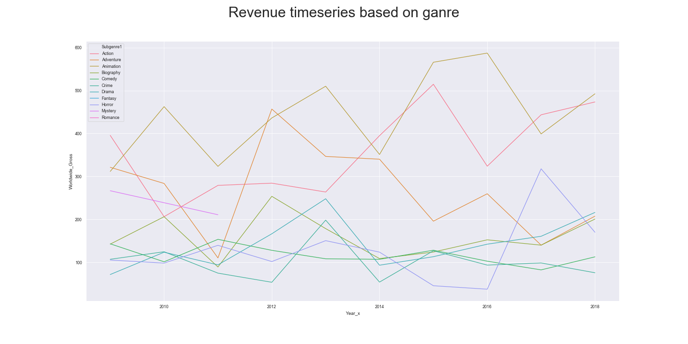

# DS Mod 1 Project #

A project focused on investigating best future practices for a major movie studio. This included best types of films, themes directors and more to invest in.

## Methodology ##

* Profitability of films is compared across movie types, critic and viewer reviews. 
* A “successful movie” was defined as one that produced a large amount of revenue and had high critic and/or viewer scores.
* Git has been used as a collaborative tool to manage version control and history.

## Sources & Parameters ##

* Web Scraping was performed for Box Office Mojo and IMDB to retrieve both quantitative and categorical data. Data from OMDB was gathered using their API and included such categorical varibles as cast, directors, plot summaries.
* Examined top grossing movies from 2009-2018 and final analysis included 790 titles.

## Questions Explored ##

* What are the top movies by world revenue?
* What is the relationship between critic/fan scores and genre?
* What is the relationship between revenue and  critic/fan scores?
* Are there any trends for revenue and critic/fan scores given genre?
* What are the general themes of the most successful movies?
* What director or type of director to hire?

## Data visualisations

 
 
_vs_imdb_based_on_genre.png) 
 
 
 
 

## Insights ##
* More of a correlation between worldwide revenue and IMDB score than worldwide revenue and Metascore
  * Even so IMDB Score and Metascore relate very strongly
* Action, drama and biopics are the most highly rated genres overall while horror movies perform the worst
* Action and animation generate the most revenue, while fantasy is surprisingly disappointing
* Christopher Nolan and Brad Bird are the only two directors from 2009 - 2018 to have directed at least two movies that weren't in the same franchise (i.e. The Avengers or The Hunger Games) that made over $500MM and had a Metascore above 60

## Recommendations ##
* Do not optimise for a huge hit as it simply doesn't happen often
* Have a diverse portfolio of movies by genre - don't be afraid to try new things
  * Specifically animation is quite profitable and biopics are highly regarded
  * Comedies are hard to scale on a global level
* Support directors that are multi-faceted and that have original ideas!
